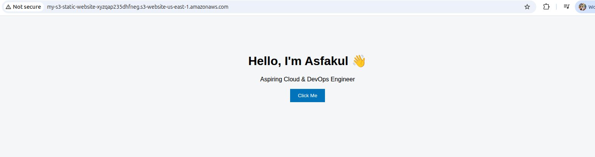

# Static Website Hosting on AWS S3

This project demonstrates how to host a static website using **Amazon S3** with public read access configured via a secure bucket policy.

## 📌 Project Overview
- Service Used: Amazon S3
- Hosting Type: Static Website Hosting
- Content: HTML, CSS, JavaScript
- Access: Public Read (GetObject only)

## 🏗 Architecture
User → S3 Static Website Endpoint → Static Files

## 🚀 Deployment Steps

### 1. Create S3 Bucket
- Create a unique S3 bucket
- Disable "Block all public access"

### 2. Enable Static Website Hosting
- Index document: `index.html`
- Error document: `error.html`

### 3. Upload Website Files
Upload contents in S3 Objects

### 4. Apply Bucket Policy
Attach the policy from folder `policies/bucket-policy.json` to allow public read access.

### 5. Access Website
http://<bucket-name>.s3-website-<region>.amazonaws.com

## 🔐 Security Considerations
- Only `s3:GetObject` is allowed
- No write or delete permissions for public users
- ACLs disabled (bucket policy used)

## 📸 Screenshots
Screenshots are available under `docs/screenshots/`.

## 🧠 Learnings
- Hosting static sites on S3
- Understanding S3 bucket policies
- Public access configuration and security

## 🛠 Future Improvements
- Add CloudFront (HTTPS)
- Route53 custom domain
- Terraform automation